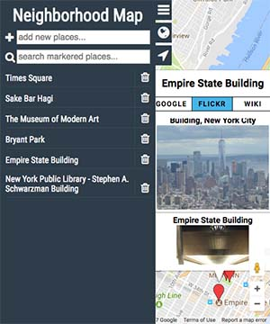

# Neighborhood Map



This is a project of Udacity's Front-End Web Developer Nanodegree Program.

A single-page web application built with Knockout.js that features a map of a neighborhood by utilizing Google Maps API. Users can search, add, filter map markers. Third-party data from Flicker and Wikipedia are provided when markers are clicked.

You can open the app [here](https://mengdage.github.io/neighbourhood-map/) :video_game:.

## Qucikstart

- Install [Node](https://nodejs.org/en/),[Gulp](http://gulpjs.com/).

- Clone the repository, navigate to this project, and install dependencies.

```
  git clone https://github.com/mengdage/neighbourhood-map.git
  cd neighbourhood-map/
  npm install
```

- Run the default gulp task to serve source files.

```
  gulp
```

## Third-party API
- [Flickr](https://www.flickr.com)
- [Wikipedia](https://www.wikipedia.org)
- [Google Maps API](https://developers.google.com/maps)
